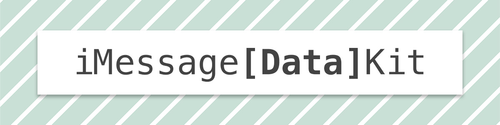

[](https://github.com/svtek)

Store custom data as key-value pairs in `MSMessage` objects.

## Contents

- [Requirements](#requirements)
- [Installation](#installation)
- [Usage](#usage)
    - [Quick Start](#quick-start)
    - [How it works](#how-it-works)
    - [Resources](#resources)
- [Idea](#idea)
- [Author](#author)
- [License](#license)

## Requirements

- iOS 10+
- Swift 3
- Messages.framework

## Installation

### CocoaPods

[CocoaPods](http://cocoapods.org) is a dependency manager for Cocoa projects. You can install it with the following command:

```bash
$ gem install cocoapods
```

To integrate `iMessageDataKit` into your Xcode project using CocoaPods, specify it in your `Podfile`:

```ruby
pod 'iMessageDataKit'
```

Then, run the following command in Terminal (from your project's root folder):

```bash
$ pod install
```

### Manual

Drag & drop `Source` folder into your Xcode project.

---

## Usage

`iMessageDataKit` extension methods enable you to use an  `MSMessage` object as a dictionary-like key-value store. You can set/get `Int`, `Bool`, `Float`, `Double`, `String` and `Array` values. Arrays should contain objects that conform to `LosslessStringConvertible` protocol.

### Quick Start

```swift
import Messages
import iMessageDataKit

class MessagesViewController: MSMessagesAppViewController {

  // ...

  func sendMessage() {

    let layout = MSMessageTemplateLayout()
    layout.caption = "A message with custom data."

    let message: MSMessage = MSMessage()
    message.layout = layout

    //
    // set custom data
    //
    message.md.set(value: 7, forKey: "user_id")
    message.md.set(value: Int(NSDate().timeIntervalSince1970), forKey: "timestamp")
    message.md.set(value: true, forKey: "is_okay")
    message.md.set(value: "john", forKey: "username")
    message.md.set(values: ["happy", "joy", "smile"], forKey: "tags")
    message.md.set(values: [7.3, 5.2], forKey: "dimensions")

    //
    // send or insert message to activeConversation ...
    //
  }

  override func didSelect(_ message: MSMessage, conversation: MSConversation) {

    //
    // access selected message's custom data
    //

    if let userId = message.md.integer(forKey: "user_id") {
      // do sth with userId
    }

    if let timestamp = message.md.integer(forKey: "timestamp") {
      // do sth with timestamp
    }

    if let isOkay = message.md.bool(forKey: "is_okay") {
      // do sth with isOkay
    }

    if let username = message.md.string(forKey: "username") {
      // do sth with username
    }

    if let tags = message.md.values(forKey: "tags") {
      // do sth with tags array
    }

    if let dimensions = message.md.values(forKey: "dimensions") {
      // do sth with dimensions array
    }
  }

  // ...

}
```

### How it works
iMessageDataKit encodes/decodes data as JSON and utilizes `url` property of `MSMessage` class to store encoded JSON string as a querystring.

### Resources
- [Messages.framework](https://developer.apple.com/documentation/messages)
- [MSMessage](https://developer.apple.com/documentation/messages/msmessage)

## Idea
- Sahin Boydas ([@sahinboydas](https://twitter.com/sahinboydas))

## Author
- Ahmet Ardal ([@ardalahmet](https://github.com/ardalahmet/))

## License
iMessageDataKit is released under the MIT license. See LICENSE for details or visit http://www.apache.org/licenses/LICENSE-2.0 for more information.
